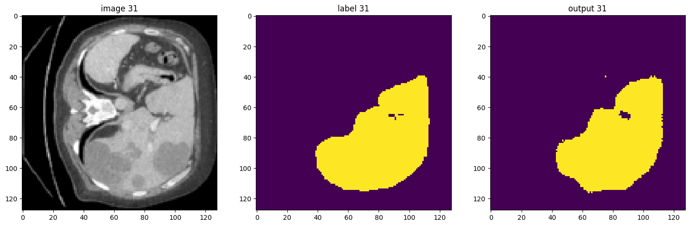
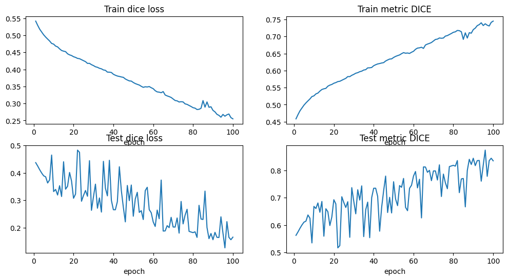

# 🫁 Liver Segmentation using U-Net and MONAI

> 3D Medical Image Segmentation of the liver from CT scans using a U-Net architecture built with MONAI and PyTorch.

---

## 📋 Project Overview

This project implements an **end-to-end pipeline** for **automatic liver segmentation** on 3D CT scans from the [Medical Segmentation Decathlon dataset](http://medicaldecathlon.com/). The goal is to produce a **binary mask** predicting, pixel by pixel, whether each voxel belongs to the liver or not.

### The full pipeline covers:

- 📂 DICOM to NIfTI conversion
- 🔪 Data preparation (grouping into 75-slice chunks)
- ⚙️ Preprocessing (resizing, intensity normalization)
- 🧠 U-Net training with Dice Loss
- 📊 Evaluation and visualization

---

## 📊 Results

| Metric | Train | Test |
|--------|:-----:|:----:|
| **Dice Score** | 0.79 | **0.84** |
| **Dice Loss** | 0.21 | **0.16** |

> ✅ Achieved with only **5 original patients** (expanded to **12 groups** after slicing), trained on **CPU only** for **100 epochs**.

**Segmentation output example:**



**Training curves:**



---

## 🗂️ Dataset

| Property | Value |
|----------|-------|
| **Source** | [Medical Segmentation Decathlon](https://medicaldecathlon.com/) — Task 03: Liver |
| **Original patients** | 5 CT scans with liver annotations |
| **After preprocessing** | 12 groups of 75 slices each |
| **Train / Test split** | 10 / 2 groups |
| **Format** | NIfTI (.nii) |

> ⚠️ Dataset **not included** in this repo due to file size. Download it from the official source above.

---

## 🏗️ Pipeline Architecture

```text
5 original patients (DICOM)
        ↓
01-Preparation_nii.ipynb
  → Split each patient into groups of 75 slices
  → Convert DICOM groups → NIfTI (.nii)
  → Remove empty groups (no liver annotation)
        ↓
02-PreProcess_train.ipynb
  → Resize: 512×512×75 → 128×128×64 (scipy.ndimage.zoom)
  → Normalize HU intensities: [-200, +200] → [0.0, 1.0]
  → Binarize labels: {0, 1}
  → MONAI transforms: LoadImaged, EnsureChannelFirstd, ScaleIntensityRanged
        ↓
03-Train.ipynb
  → U-Net (MONAI) — 3D segmentation
  → Loss: DiceLoss (to_onehot_y=True, sigmoid=True)
  → Optimizer: Adam (lr=1e-4)
  → 100 epochs on CPU
  → Saves best model: best_metric_model.pth
        ↓
04-Testing.ipynb
  → Load best model
  → Evaluate on test set
  → Visualize predictions vs ground truth
```

---

## 🧠 Model Architecture — U-Net

```text
Input (1, 128, 128, 64)
    ↓ Encoder
      Conv3D → ReLU → MaxPool (×4 levels)
    ↓ Bottleneck
      1024 feature maps
    ↓ Decoder
      UpConv + Skip Connections (×4 levels)
    ↓ Output
      Conv1×1 → Binary mask (1, 128, 128, 64)
```

**Key concepts:**

- 🔗 **Skip connections** — preserve spatial details lost during downsampling
- 🎯 **Dice Loss** — handles class imbalance (88% background / 12% liver)
- 💾 **Batch size = 1** — adapted for CPU training with limited RAM

---

## ⚙️ Technical Choices

| Parameter | Value | Reason |
|-----------|:-----:|--------|
| **Input size** | `128×128×64` | RAM constraint (CPU only, ~6GB available) |
| **Batch size** | `1` | Avoid RAM saturation on CPU |
| **Learning rate** | `1e-4` | Standard for medical image segmentation |
| **Epochs** | `100` | Convergence observed after ~80 epochs |
| **Loss function** | `Dice Loss` | Handles background/liver imbalance naturally |
| **Resize method** | `scipy.ndimage.zoom` | MONAI Resized caused kernel crashes on CPU |

---

## 📁 Repository Structure

```text
liver-segmentation/
├── notebooks/
│   ├── 01-Preparation_nii.ipynb     # DICOM → NIfTI + grouping + cleaning
│   ├── 02-PreProcess_train.ipynb    # Resize + normalize + MONAI pipeline
│   ├── 03-Train.ipynb               # U-Net training loop
│   ├── 04-Testing.ipynb             # Evaluation + visualization
│   └── 05-Utilities.ipynb           # Helper functions (dice_metric, train, show_patient)
├── sample_data/
│   └── dicom_groups/
│       └── liver_0_0/               # Example: 1 group of 75 DICOM slices
├── results/
│   ├── loss_train.npy
│   ├── loss_test.npy
│   ├── metric_train.npy
│   ├── metric_test.npy
│   └── plots/
│       ├── training_curves.png
│       └── segmentation_result.png
├── requirements.txt
├── .gitignore
└── README.md
```

---

## 🚀 Getting Started

### 1. Clone the repository

```bash
git clone https://github.com/rowan26/liver-segmentation.git
cd liver-segmentation
```

### 2. Create conda environment

```bash
conda create -n liver python=3.10
conda activate liver
pip install -r requirements.txt
```

### 3. Download the dataset

Download **Task03_Liver** from [Medical Segmentation Decathlon](https://medicaldecathlon.com/) and place it in:

```text
datasets/DICOM_files/
```

### 4. Run the pipeline

Execute notebooks in order:

```text
01 → 02 → 03 → 04
```

---

## 📦 Dependencies

```text
torch==2.4.1+cpu
monai
nibabel
numpy
scipy
matplotlib
dicom2nifti
tqdm
```

> Full list available in `requirements.txt`

---

## ⚠️ Known Limitations

- Trained on **CPU only** → long training time (~1-2h per epoch)
- Only **5 original patients** → limited generalization
- **No data augmentation** applied
- `MONAI Resized` replaced by `scipy.ndimage.zoom` due to RAM constraints

---

## 🔮 Future Improvements

- [ ] GPU training (AWS EC2 / Google Colab)
- [ ] Data augmentation (rotations, flips, elastic deformations)
- [ ] More patients (full 130-patient Decathlon dataset)
- [ ] Post-processing (keep largest connected component)
- [ ] MLflow experiment tracking
- [ ] FastAPI deployment + Docker containerization
- [ ] AWS S3 model storage

---

## 👤 Author

**Rowan Hadjaz**  
Cybersecurity & AI Consultant @ Wavestone  
AI Engineering Graduate — ISEN JUNIA  

[](https://github.com/rowan26)
[](https://www.linkedin.com/in/rowan-hadjaz)
