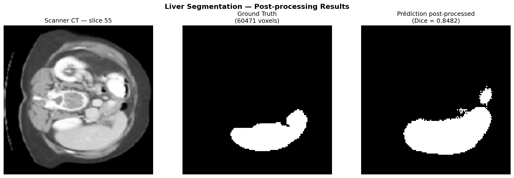

# 🫁 Liver Segmentation using U-Net and MONAI
> 3D Medical Image Segmentation of the liver and liver tumors from CT scans using a U-Net architecture built with MONAI and PyTorch.

---

## 📋 Project Overview

This project implements an **end-to-end pipeline** for **automatic liver and tumor segmentation** on 3D CT scans from the [Medical Segmentation Decathlon dataset](http://medicaldecathlon.com/). The model produces a **3-class segmentation mask** : background · liver · tumor.

### The full pipeline covers:
- 📂 DICOM to NIfTI conversion
- 🔪 Data preparation (grouping into 75-slice chunks)
- ⚙️ Preprocessing (resizing, intensity normalization, class-safe label rounding)
- 🧠 3D U-Net training with DiceCELoss + 7 augmentation transforms
- 📊 Per-class evaluation (liver / tumor, no background)
- 🧹 Post-processing (connected component filtering)
- ☁️ GPU training on Google Colab (Tesla T4)

---

## 📊 Results

### Binary Segmentation — 5 patients, CPU (Run 0)

| Metric | Train | Test (raw) | Test (post-processed) |
|--------|:-----:|:----------:|:---------------------:|
| **Dice Score — without augmentation** | 0.79 | 0.50 | 0.72 |
| **Dice Score — with augmentation** | 0.74 | **0.8741** | **0.8482** |

### Multi-class Segmentation — 131 patients, GPU T4

| Run | Loss | Epochs | 🫁 Dice Foie | 🔴 Dice Tumeur | 📊 Dice Moyen | Best Epoch |
|-----|------|:------:|:------------:|:--------------:|:-------------:|:----------:|
| Run 1 | DiceLoss | 200 | 0.8327 | 0.2250 | 0.5289 | 59 |
| **Run 2** | **DiceCELoss** | **200** | **0.8797** | **0.2662** | **0.5730** | **155** |

> ✅ Run 2 trained on **131 patients** (117 train / 14 test) on **Google Colab GPU T4**.  
> 📈 DiceCELoss + 7 augmentation transforms improved tumor Dice from **0.225 → 0.266** (+4.1 pts).  
> 🔴 Tumor segmentation remains challenging due to small lesion size and class imbalance.

**Segmentation output — after post-processing:**


**Training curves:**


---

## 🗂️ Dataset

| Property | Value |
|----------|-------|
| **Source** | [Medical Segmentation Decathlon](https://medicaldecathlon.com/) — Task 03: Liver |
| **Original patients** | 131 CT scans (1 corrupted: liver_67 removed) |
| **Classes** | 0 = background · 1 = liver · 2 = tumor |
| **Train / Test split** | 117 / 14 (90/10) |
| **Format** | NIfTI (.nii.gz) |

> ⚠️ Dataset **not included** in this repo due to file size (~27GB). Download from the official source above.

---

## 🏗️ Pipeline Architecture

```text
131 patients (NIfTI .nii.gz)
        ↓
Colab_fullDataset_Decathlon.ipynb
  ├── Download from AWS S3 (~27GB, skip if present)
  ├── Filter corrupted files (liver_67 removed)
  ├── Preprocessing → saved to Drive (one-time):
  │     Spacingd (1.5×1.5×1.0mm) + Orientationd (RAS)
  │     ScaleIntensityRanged [-200,+200] → [0,1]
  │     CropForegroundd + Resized [128×128×80]
  │     Lambdad → label.round().long() → {0,1,2}
  ├── 7 augmentation transforms (train only)
  ├── 3D U-Net — out_channels=3
  ├── DiceCELoss (softmax, multiclass)
  ├── Adam lr=1e-4 + ReduceLROnPlateau (patience=25)
  └── 200 epochs on Tesla T4 → best model saved to Drive
        ↓
Testing + PostProcessing (local CPU)
  → Dice Foie: 0.8797 | Dice Tumeur: 0.2662
```

---

## 🧠 Model Architecture — U-Net

```text
Input (1, 128, 128, 80)
    ↓ Encoder — Conv3D → ReLU → MaxPool (×4 levels)
    ↓ Bottleneck — 256 feature maps
    ↓ Decoder — UpConv + Skip Connections (×4 levels)
    ↓ Output — Conv1×1 → 3 channels (background / liver / tumor)
```

**Key concepts:**
- 🔗 **Skip connections** — preserve spatial details lost during downsampling
- 🎯 **DiceCELoss** — combines Dice + CrossEntropy for better small structure detection
- 🔁 **Residual units** — better gradient propagation
- 🎲 **Softmax output** — probabilities sum to 1 across all 3 classes

---

## 📈 Data Augmentation

Applied **only on training data** — never on test data.

| Transform | Role | Parameters |
|-----------|------|------------|
| `RandFlipd` (×3 axes) | Geometric flip | prob=0.5 |
| `RandRotate90d` | 90°/180°/270° rotation | prob=0.5 |
| `RandZoomd` | Random zoom ±15% | prob=0.4 |
| `RandScaleIntensityd` | Intensity scale ±15% | prob=0.5 |
| `RandShiftIntensityd` | Intensity shift ±10% | prob=0.5 |
| `RandGaussianNoised` | Gaussian noise | prob=0.3 |
| `RandGaussianSmoothd` | Gaussian smoothing | prob=0.2 |

> Intensity transforms simulate inter-scanner variability — crucial with only 131 patients.

---

## ⚙️ Technical Choices

| Parameter | Local CPU | Google Colab GPU | Reason |
|-----------|:---------:|:----------------:|--------|
| **Device** | Intel Iris Plus | Tesla T4 | — |
| **Input size** | `128×128×80` | `128×128×80` | RAM constraint |
| **Batch size** | `1` | `1` | Stable gradients |
| **num_workers** | `0` | `2` | Linux parallelism |
| **Learning rate** | `1e-4` | `1e-4` | Standard medical segmentation |
| **LR Scheduler** | ReduceLROnPlateau | ReduceLROnPlateau | patience=25 |
| **Loss** | DiceLoss | DiceCELoss | Better tumor detection |
| **Epochs** | `100` | `200` | GPU allows more |
| **Post-processing** | `scipy.ndimage.label` | — | Removes false positives |

---

## 📁 Repository Structure

```text
Liver_Segmentation/
├── notebooks/
│   ├── Preparation_nii.ipynb                  # DICOM → NIfTI + grouping + cleaning
│   ├── PreProcess_train.ipynb                 # Local preprocessing pipeline
│   ├── Train.ipynb                            # U-Net training (CPU, binary)
│   ├── Testing.ipynb                          # Evaluation + visualization
│   ├── Utilities.ipynb                        # Helper functions
│   ├── PostProcessing.ipynb                   # Connected components → Dice 0.8482
│   └── Colab_fullDataset_Decathlon.ipynb      # Full pipeline GPU — 131 patients, 3 classes 🏆
├── sample_data/
│   └── dicom_groups/
│       └── liver_0_0/                         # Example: 1 group of 75 DICOM slices
├── results/
│   ├── loss_train.npy
│   ├── loss_test.npy
│   ├── metric_train.npy
│   ├── metric_test.npy
│   └── plots/
│       ├── training_curves.png
│       ├── segmentation_result.png
│       └── postprocessing_result.png
├── requirements.txt
├── .gitignore
└── README.md
```

---

## 🚀 Getting Started

### Local (CPU — Binary Segmentation)

```bash
git clone https://github.com/rowan26/Liver_Segmentation.git
cd Liver_Segmentation
conda create -n dicom_env python=3.8
conda activate dicom_env
pip install -r requirements.txt
```

Run notebooks in order:
```text
Preparation_nii → PreProcess_train → Train → Testing → PostProcessing
```

### Google Colab (GPU — Multi-class Segmentation) — Recommended

1. Open `notebooks/Colab_fullDataset_Decathlon.ipynb` in Google Colab
2. Set **Runtime → GPU (T4)**
3. Mount your Google Drive
4. Run all cells — the notebook handles download, preprocessing, training and evaluation

---

## 📦 Dependencies

```text
torch · monai · nibabel · numpy · scipy · matplotlib · dicom2nifti · tqdm
```

> Full list available in `requirements.txt`

---

## ⚠️ Known Limitations & Next Steps

| Limitation | Impact | Planned fix |
|------------|--------|-------------|
| Resize 128×128×80 | Loss of resolution on small tumors | Sliding window with patch-based training |
| Batch size 1 | Noisy gradients | Increase with more VRAM |
| 14 test patients | High variance (±0.10/epoch) | Larger test set |
| Tumor Dice ~0.27 | Below clinical threshold | Run 3 with fine-tuning |

---

## 🔮 Future Improvements

- [x] Data augmentation ✅ Dice 0.50 → 0.87
- [x] Post-processing — connected component ✅ Dice = 0.8482
- [x] Learning Rate Scheduler (ReduceLROnPlateau) ✅ patience=25
- [x] GPU training on Google Colab (Tesla T4) ✅ Dice = 0.8797 (liver)
- [x] Multi-class segmentation (liver + tumor) ✅ DiceCELoss + 7 augmentations
- [ ] Run 3 — fine-tuning from best checkpoint (lr=5e-5)
- [ ] Patch-based training + Sliding Window Inference
- [ ] MLflow experiment tracking
- [ ] FastAPI deployment (POST /predict → .nii → segmentation mask)
- [ ] Docker containerization
- [ ] Streamlit app — upload DICOM → liver segmentation + tumor detection
- [ ] AWS S3 model storage

---

## 👤 Author

**Rowan Hadjaz**  
Cybersecurity & AI Consultant @ Wavestone  
AI Engineering Graduate — ISEN JUNIA

[](https://github.com/rowan26)
[](https://www.linkedin.com/in/rowan-hadjaz)
